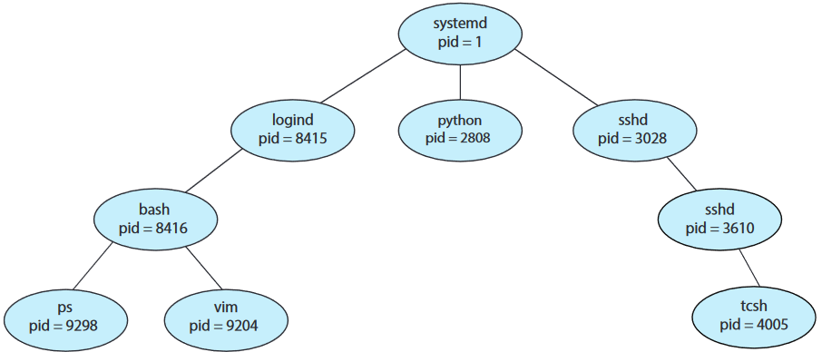

# Exercises

## 3.8

Describe the actions taken by a kernel to context-switch between processes.

1. save current process' state (program counter, register set) into the memory
2. load the new process state (program counter, register set) from the memory
3. run

## 3.9

Construct a process tree similar to figure below. To obtain process information for the UNIX or Linux system, use the command `ps -ael`. Use the command `man ps` to get more information about the `ps` command. The task manager on Windows systems does not provide the parent process ID, but the process monitor tool, available from [technet.microsoft.com](https://docs.microsoft.com/ko-kr/), provides a process-tree tool.



* Idle
* System
	* Registry
	* smss.exe
	* MemCompression
* csrss.exe
* wininit.exe
	* services.exe
		* svchost.exe
			* wmiprvse.exe
			* &hellip;
			* DllHost.exe
		* WUDFHost.exe
		* &hellip;
		* svchost.exe
			* taskhostw.exe
			* itype.exe
			* ipoint.exe
				* MKCHelper.exe
		* &hellip;
		* NVDisplay.Container.exe
			* NVDisplay.Container.exe
		* svchost.exe
		* &hellip;
	* lsass.exe
	* fontdrvhost.exe
* csrss.exe
* WinLogon.exe
	* hellip;
* Explorer.EXE
	* &hellip;
* &hellip;
* firefox.exe
	* &hellip;
* &hellip;

## 3.10

Explain the role of the `init` (or `systemd`) process on UNIX and Linux systems in regard to process termination.

`init` becomes step parent to those child process whose parent process terminated without terminating its children, then `init` takes charge to terminate the orphan process to avoid zombie processes.

when process terminates, `init` receives the status code to tell whether or not the termination was valid or not.

## 3.11

Including the initial parent process, how many processes are created by the program shown below?

```c
#include <stdio.h>
#include <unistd.h>

int main()
{
	int i;
	for (i = 0; i < 4; i++) {
		fork();
	}

	return 0;
}
```

* parent
	1. child0
		1. child0_1
			1. child0_1_2
				1. child0_1_2_3
			2. child0_1_3
		2. child0_2
			1. child0_2_3
		3. child0_3
	2. child1
		1. child1_2
			1. child1_2_3
		2. child1_3
	3. child2
		1. child2_3
	4. child3

16 processes

## 3.12

Explain the circumstances under which the line of code marked `printf("LINE J")` in below code will be reached.

```c
#include <sys/types.h>
#include <stdio.h>
#include <unistd.h>

int main()
{
	pid_t pid;

	/* fork a child process */
	pid = fork();

	if (pid < 0) {	/* error occurred */
		fprintf(stderr, "Fork Failed");
		return 1;
	} else if (pid == 0) {	/* child process */
		execlp("/bin/ls","ls",NULL);
		printf("LINE J");
	} else {	/* parent process */
		/* parent will wait for the child to complete */
		wait(NULL);
		printf("Child Complete");
	}

	return 0;
}
```

`execlp` replaces current process with `ls`, thus LINE J will not be executed.

## 3.13

Using the program below, identify the values of pid at lines A, B, C, and D. (Assume that the actual pids of the parent and child are 2600 and 2603, respectively.)

```c
#include <sys/types.h>
#include <stdio.h>
#include <unistd.h>

int main()
{
	pid_t pid;
	pid_t pid1;

	/* fork a child process */
	pid = fork();

	if (pid < 0) {	/* error occurred */
		fprintf(stderr, "Fork Failed");
		return 1;
	} else if (pid == 0) {	/* child process */
		pid1 = getpid();
		printf("child: pid = %d",pid); /* A */
		printf("child: pid1 = %d",pid1); /* B */
	} else {	/* parent process */
		pid1 = getpid();
		printf("parent: pid = %d",pid); /* C */
		printf("parent: pid1 = %d",pid1); /* D */
		wait(NULL);
	}

	return 0;
}
```

A: 0
B: 2603
C: 2603
D: 2600

## 3.14

Give an example of a situation in which ordinary pipes are more suitable than named pipes and an example of a situation in which named pipes are more suitable than ordinary pipes.

Ordinary pipes: when secure connection is needed

Names pipes: when multiple senders are expected, and that specific connection might stay permanent

## 3.15

Consider the RPC mechanism. Describe the undesirable consequences that could arise from not enforcing either the “at most once”or “exactly once” semantic. Describe possible uses for a mechanism that has neither of these guarantees.

## 3.16

Using the program shown below, explain what the output will be at lines X and Y.

```c
#include <sys/types.h>
#include <stdio.h>
#include <unistd.h>

#define SIZE 5

int g_nums[SIZE] = { 0, 1, 2, 3, 4 };

int main()
{
	int i;
	pid_t pid;

	pid = fork();

	if (pid == 0) {
		for (i = 0; i < SIZE; i++) {
			g_nums[i] *= -i;
			printf("CHILD: %d ", g_nums[i]); /* LINE X */
		}
	} else if (pid > 0) {
		wait(NULL);
		for (i = 0; i < SIZE; i++) {
			printf("PARENT: %d ",g_nums[i]); /* LINE Y */
		}
	}

	return 0;
}
```

## 3.17

What are the benefits and the disadvantages of each of the following? Consider both the system level and the programmer level.

a. Synchronous and asynchronous communication
b. Automatic and explicit buffering
c. Send by copy and send by reference
d. Fixed-sized and variable-sized messages