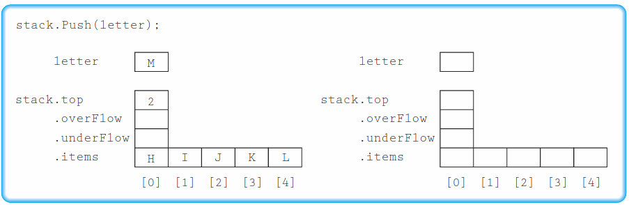
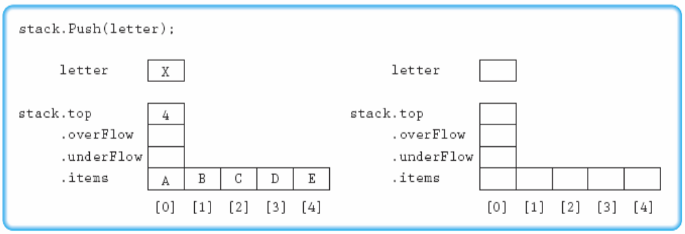
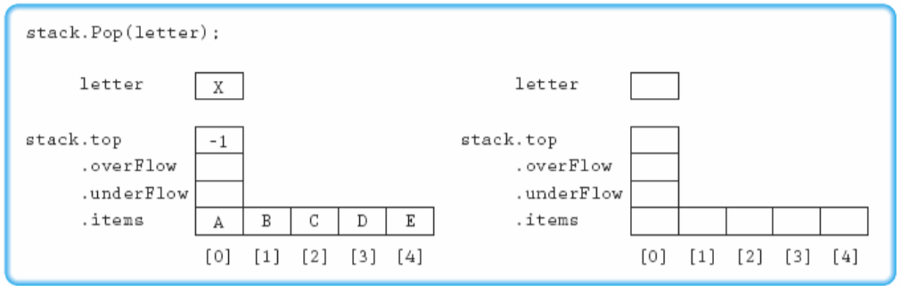
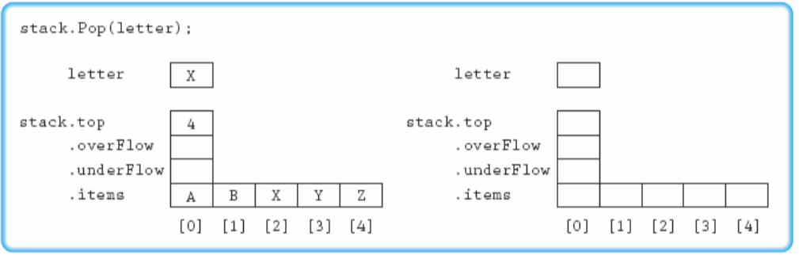

# 01
## Exercise 02
Describe the accessing protocol of a stack at the abstract level

Stack is fundamentally a FILO, or a LIFO data structure.<br>
This means that both input and output of an element in the data occurs at the very end-`top`- of the stack.<br>
The input is often called `push` while output is called `pop`.

# 02
Use the following information for Exercises 4–7. The stack is implemented as a class containing an array of items, a data member indicating the index of the last item  put  on  the  stack(`top`),  and  two  Boolean  data  members, `underFlow` and `overFlow`.    The stack items are characters and `MAX_ITEM` is 5. In each exercise, show the result of the operation on the stack. Put a *T* or *F* for true or false, respectively, in the Boolean data members.

## Exercise 04
`stack.Push(letter):`


* `stack.top` : `3`
* `stack.overFlow` : `false`
* `stack.underFlow` : `false`
* `stack.items` : `{'H', 'I', 'J', 'M', 'L'}`

## Exercise 05
`stack.Push(letter):`


* `stack.top` : `4`
* `stack.overFlow` : `true`
* `stack.underFlow` : `false`
* `stack.items` : `{'A', 'B', 'C', 'D', 'E'}`

## Exercise 06
`stack.Pop(letter):`


* `stack.top` : `-1`
* `stack.overFlow` : `false`
* `stack.underFlow` : `true`
* `stack.items` : `{'A', 'B', 'C', 'D', 'E'}`

## Exercise 07
`stack.Pop(letter):`


* `stack.top` : `3`
* `stack.overFlow` : `false`
* `stack.underFlow` : `false`
* `stack.items` : `{'A', 'B', 'X', 'Y', 'Z'}`

# 03
## Exercise 11
Given the following specification of the `Top` operation:
* `ItemType Top`
* Function
	* Returns a copy of the last item put onto the stack
* Precondition
	* Stack is not empty
* Postcondition
	* Function value = copy of item at top of stack.
	* Stack is not changed
Assume `Top` is not a stack operation and `Pop` returns the item removed. Write this  function  as  client  code,  using  operations  from  the  nontemplate  version of the `StackType` class. Remember—the client code has no access to the private members of the class.

### A. `Top` 함수를 `StackType` 클래스의 클라이언트로 작성한다. 이 경우 `Top()` 함수는 스택 객체 하나를 파라메터로 받는다. `template`를 사용하지 않고 구현한 `StackType` 클래스를 사용한다.
```c++
#include <cassert>
ItemType Top(const StackType& stack)
{
	assert(stack.IsEmpty() == false);

	return stack.Top();
}
```

### B. `Top` 함수를 `StackType`의 멤버 함수가 되도록 `StackType`을 수정한다. `template`를 사용하지 않고 구현한 `StackType` 클래스를 사용한다.
#### `StackType.h`
```c++
#include <cassert>
typedef int ItemType;
struct NodeType;

class StackType
{
public:
	StackType();
	~StackType();
	bool IsFull() const;
	bool IsEmpty() const;
	void Push(ItemType item);
	void Pop();
	ItemType Top();

private:
	NodeType* topPtr;
};

struct NodeType
{
	ItemType info;
	NodeType* next;
};
```

#### `StackType.cpp`
```c++
...
ItemType StackType::Top()
{
	assert(topPtr != nullptr);

	return topPtr->info;  
}
...
```

# 04
## Exercise 18
Implement the following specification for a client Boolean function that returns true if two stacks are identical and false otherwise.
* `Boolean Identical(StackType stack1, StackType stack2)`
* Function
	* Determines if two stacks are identical
* Preconditions
	* stack1 and stack2 have been initialized.
* Postconditions
	* stack1 and stack2 are unchanged.
	* Function value = (stack1 and stack2 are identical)

You  may  use  any  of  the  member  functions  of  `StackType`,  but  you  may  not assume any knowledge of the stack’s implementation.

### A. `Identical` 함수를 `StackType` 클래스의 클라이언트로 작성한다. `template`를 사용하지 않고 구현한 `StackType` 클래스를 사용한다.
```c++
bool Identical(const StackType& stack1, const StackType& stack2)
{
	StackType tempStack1;
	StackType tempStack2;
	bool bResult;

	// Check each values in each stacks while holding their values to a temporary stack
	while (!stack1.IsEmpty() && !stack2.IsEmpty())
	{
		if (stack1.Top() != stack2.Top())
		{
			bResult = false;
			break;
		}

		tempStack1.Push(stack1.Top())
		tempStack2.Push(stack2.Top())
		stack1.Pop();
		stack2.Pop();
	}

	// When loop ends, check whether both stacks had identical length. If not, they are not identical. One stack is a substack of the other.
	bResult = (stack1.IsEmpty() && stack2.IsEmpty());

	// Restore stacks
	while (!tempStack1.IsEmpty())
	{
		stack1.Push(tempStack1.Top());
		tempStack1.Pop();
	}

	while (!tempStack2.IsEmpty())
	{
		stack2.Push(tempStack2.Top());
		tempStack2.Pop();
	}

	return bResult;
}
```

### B. `Identical` 함수를 `StackType`의 멤버 함수가 되도록 `StackType`을 수정한다. 이 경우 host object가 비교 대상중 하나로 사용되기 때문에 `Identical` 함수는 파라메터를 하나만 가지게 된다. `template`를 사용하지 않고 구현한 `StackType` 클래스를 사용한다.
#### `StackType.h`
```c++
typedef int ItemType;
struct NodeType;

class StackType
{
public:
	StackType();
	~StackType();
	bool IsFull() const;
	bool IsEmpty() const;
	void Push(ItemType item);
	void Pop();
	ItemType Top();
	bool Identical(const StackType& other) const;

private:
	NodeType* topPtr;
};

struct NodeType
{
	ItemType info;
	NodeType* next;
};
```
#### `StackType.cpp`
```c++
...
bool StackType::Identical(const StackType& other) const
{
	NodeType* myIterator = topPtr;
	NodeType* otherIterator = other.topPtr;
	while (myIterator != nullptr && otherIterator != nullptr)
	{
		if (myIterator->info != otherIterator->info)
		{
			return false;
		}

		myIterator = myIterator->next;
		otherIterator = otherIterator->next;
	}

	return (myIterator == nullptr && otherIterator == nullptr);
}
...
```