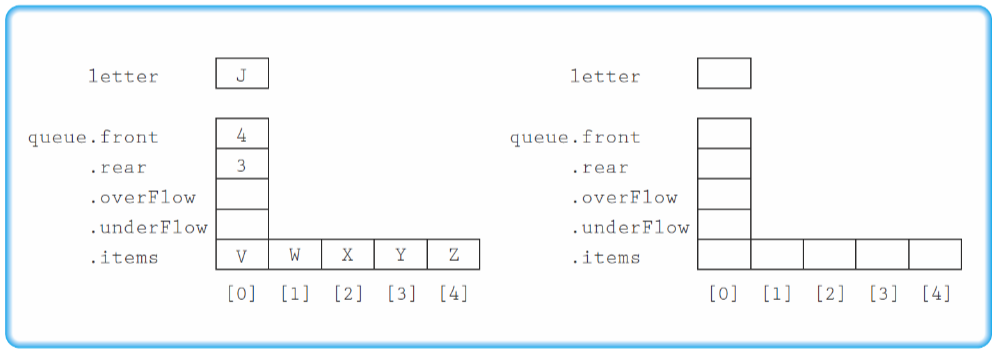
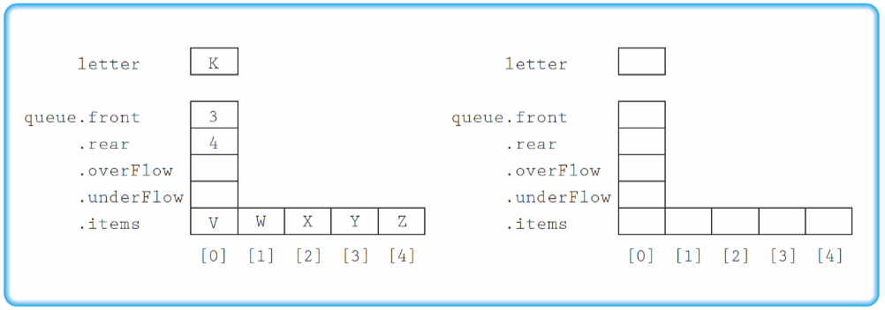
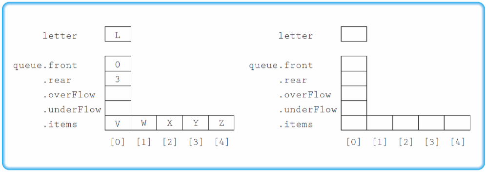
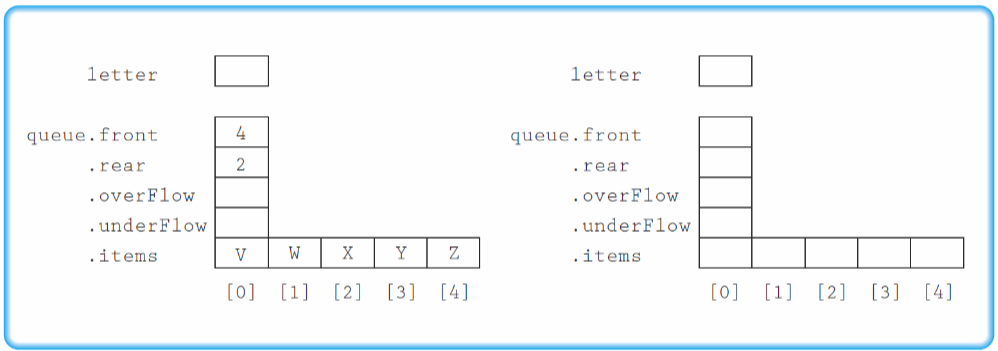
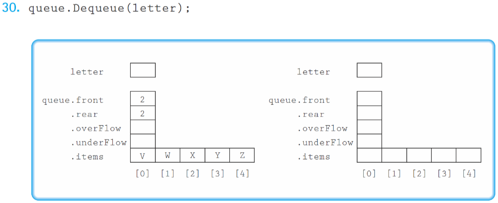
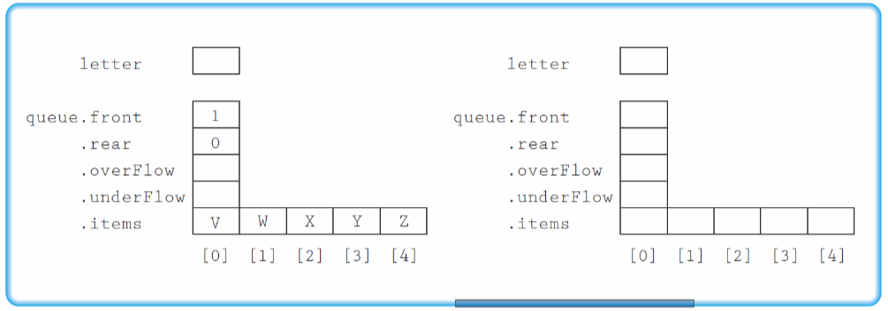

# 23. Describe the accessing protol of a queue at the abstract level.
* Item Insertion
	* occurs after the last item of the `queue`(`rear`)
	* `Enqueue`
* Item Removal
	* occurs at the very first item of the `queue`(`(front + 1) % maxQue`)
	* `Dequeue`
* Item Access
	* First, `Dequeue` an item to access, then `Enqueue` it back to the `queue`.

# 26-31
Use the following information for Exercises 26-31. The queue is implemented as a class containing an array of items, a data member indicating the index of the last item put on the queue(`rear`), a data member indicating the index of the location before the first item put on the queue(`front`), and two Boolean data members, `underFlow` and `overFlow`, as discussed in this chapter. The item type is `char` and `maxQue` is 5. For each exercise, show the result of the operation ont he queue. put a *T* or *F* for true or false, respectively, in the Boolean data members.
## 26 `queue.Enqueue(letter);`

* `queue` is already full
* `overFlow`: T
* `underFlow` : F

## 27 `queue.Enqueue(letter);`

* `queue` has only one item
* `overFlow`: F
* `underFlow` : F

## 28 `queue.Enqueue(letter);`

* `queue` has not full
* `overFlow`: F
* `underFlow` : F

## 29 `queue.Dequeue(letter);`

* `queue` has more than one item
* `overFlow`: F
* `underFlow` : F

## 30 `queue.Enqueue(letter);`

* `queue` is empty
* `overFlow`: F
* `underFlow` : T

## 31 `queue.Enqueue(letter);`

* `queue` is full
* `overFlow`: F
* `underFlow` : F

# 32 Write a segment of code to perform each of the following operations. You may call any of the member functions of `QueType`. The details of the queue are encapsulated; you may use only the queue operations in the specification to perform the operations. (You may declare additional queue objects.)
## a. Set `secondElement` to the second element in the queue, leaving the queue without its original front two elements
```c++
#include "QueType.h"
// ...
ItemType item;
ItemType secondElement;
queue.Dequeue(item);
queue.Dequeue(item);

QueType tempQueue;
while (!queue.IsEmpty())
{
	queue.Dequeue(item);
	tempQueue.Enqueue(item);
}

tempQueue.Dequeue(item);
queue.Enqueue(item);
queue.Enqueue(secondElement);

while (!tempQueue.IsEmpty())
{
	tempQueue.Dequeue(item);
	queue.Enqueue(item);
}
// ...
```
## b. Set `last` equal to the rear element in the queue, leaving the queue empty.
```c++
#include "QueType.h"
// ...
ItemType last;
queue.Dequeue(last);
queue.MakeEmpty();
// ...
```
## c. Set `last` equal to the rear element in the queue, leaving the queue unchanged.
```c++
#include "QueType.h"
// ...
QueType tempQueue;
ItemType last;
queue.Dequeue(last);
tempQueue.Enqueue(last);

ItemType item;
while (!queue.IsEmpty())
{
	queue.Dequeue(item);
	tempQueue.Enqueue(item);
}

while (!tempQueue.IsEmpty())
{
	tempQueue.Dequeue(item);
	queue.Enqueue(item);
}
// ...
```
## d. Make a copy of the queue, leaving the queue unchanged.
```c++
#include "QueType.h"
// ...
QueType tempQueue;
QueType copyQueue;
ItemType item;
while (!queue.IsEmpty())
{
	queue.Dequeue(item);
	copyQueue.Enqueue(item);
	tempQueue.Enqueue(item);
}

while (!tempQueue.IsEmpty())
{
	tempQueue.Dequeue(item);
	queue.Enqueue(item);
}
// ...
```

# 35 Given the following specification of a `Front` operation:
> `ItemType Front`
> * Function
> 	* Returns a copy of the front item on the queue
> * Preconditions
> 	* Queue is not empty
> * Postconditions
> 	* Function value = copy of the front item on the queue
> 	* Queue is not changed

## a. Write this function as client code, using operations from the `QueType` class. (Remember-the client code has no access to the private members of the class)
```c++
#include "QueType.h"

#include <cassert>
// ...
ItemType Front(QueType& queue);

// ...

ItemType Front(QueType& queue);
{
	assert(!queue.IsEmpty());

	QueType tempQueue;
	ItemType item;
	ItemType frontItem;
	while (!queue.IsEmpty())
	{
		queue.Dequeue(item);
		if (queue.IsEmpty())
		{
			frontItem = item;
		}
		tempQueue.Enqueue(item);
	}

	while (!tempQueue.IsEmpty())
	{
		tempQueue.Dequeue(item);
		queue.Enqueue(item);
	}

	return frontItem;
}
// ...
```
## b. Write this function as a new member function of the `QueType` class.
* `QueType.h`
```c++
class QueType
{
// ...
public:
	// ...
	ItemType Front() const;
	// ...
// ...
};
```

* `QueType.cpp`
```c++
#include "QueType.h"
// ...
ItemType QueType::Front() const
{
	assert(!IsEmpty());

	return items[(front + 1) % maxQueue];
}
// ...
```
